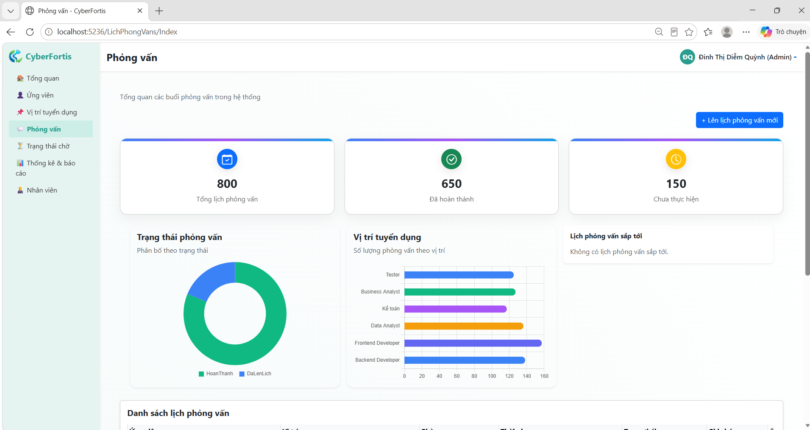

# Recruitment Management System

A recruitment management website developed using ASP.NET Core MVC and SQL Server.

This project supports the internal recruitment process, including candidate management, recruitment positions, interview scheduling, role-based access, and recruitment reports.

## Features

- User authentication and role-based authorization
- Admin dashboard with recruitment statistics
- Candidate management
- Candidate import from Excel
- Recruitment position management
- Interview scheduling
- Second-round interview waiting list
- Interviewer dashboard
- Employee management
- Reports and statistics

## Roles

- Admin
- HR
- Interviewer

## Technologies

- ASP.NET Core MVC
- Entity Framework Core
- SQL Server
- HTML
- CSS
- Bootstrap
- JavaScript
- Chart.js

## Screenshots

## Project Status

This project was developed as a university project and is currently being improved for portfolio purposes.
