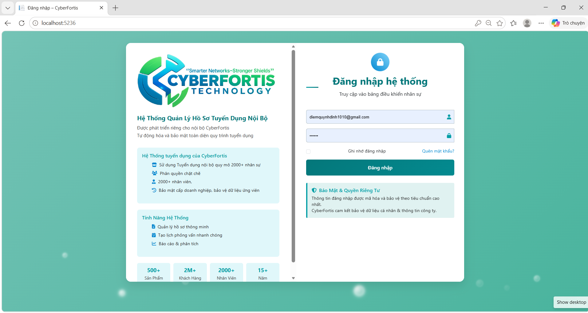
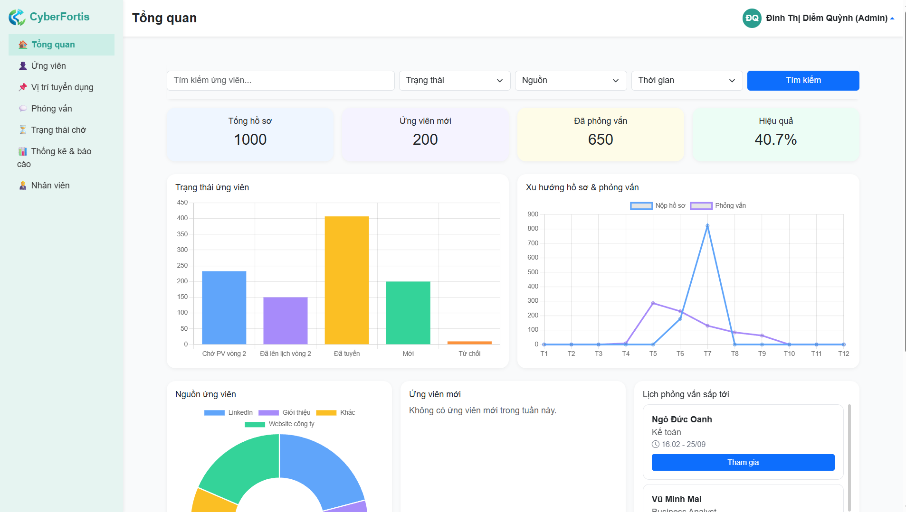
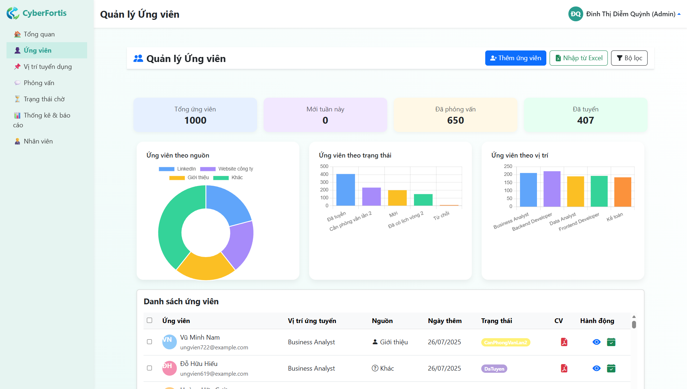
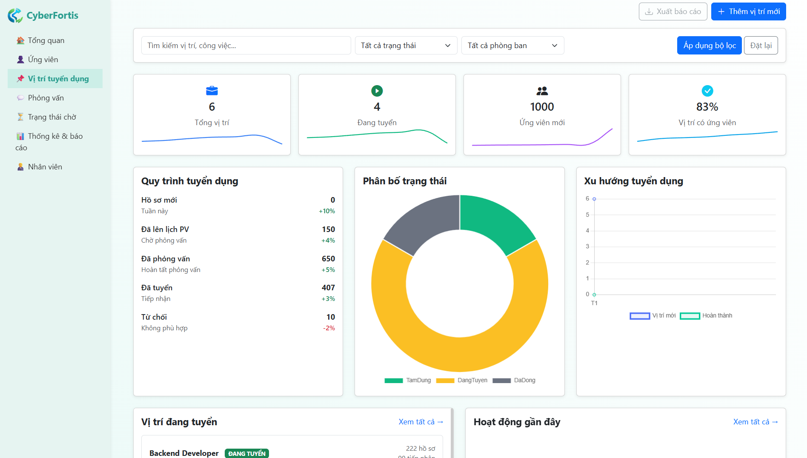
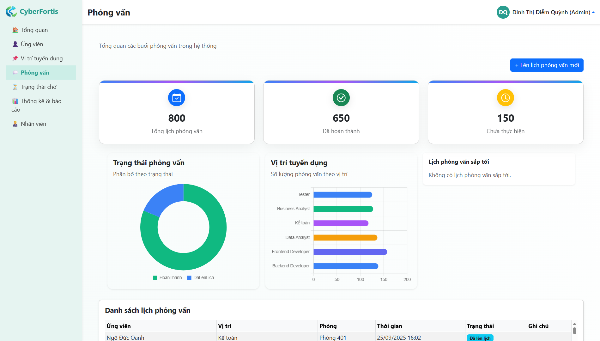
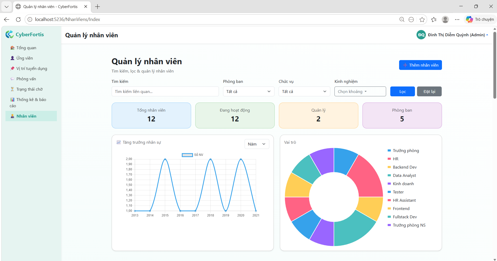
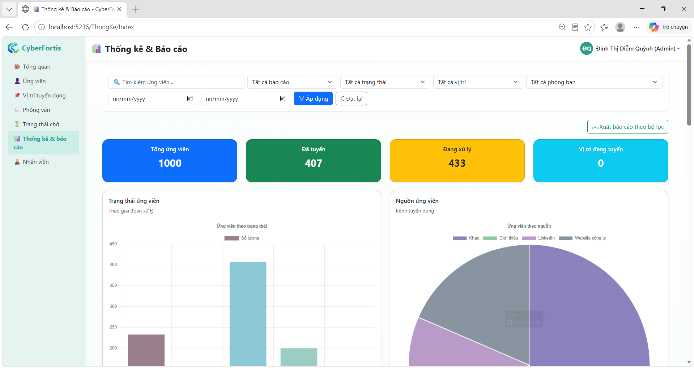
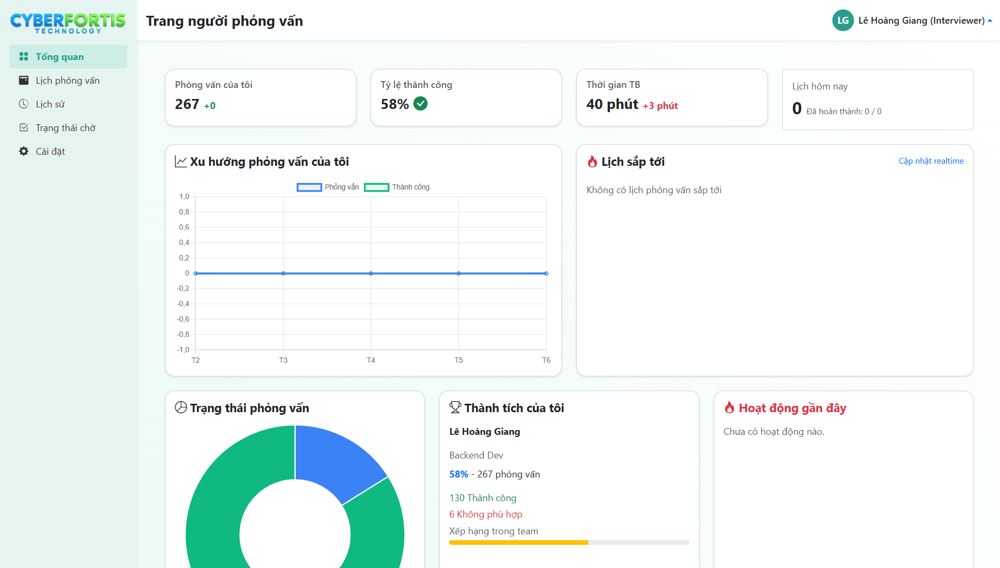

# CyberFortis - Recruitment Management System

CyberFortis is a web-based recruitment management system developed using ASP.NET Core MVC and SQL Server. The project supports candidate management, interview scheduling, employee management, and recruitment reporting.

## Features

- Candidate Management
- Recruitment Position Management
- Interview Scheduling
- Candidate Evaluation
- Employee Management
- Recruitment Statistics and Reports
- Role-Based Authorization (Admin, HR, Interviewer)
- Forgot Password and Email Verification

## Technology Stack

- ASP.NET Core MVC
- Entity Framework Core
- SQL Server
- Bootstrap 5
- JavaScript
- jQuery
- Chart.js

## Screenshots

### Login Page



### Admin Dashboard



### Candidate Management



### Recruitment Position Management



### Interview Management



### Employee Management



### Reports and Statistics



### Interviewer Dashboard



## Installation

Clone the repository:

```bash
git clone https://github.com/DiemQuynh10/QuanLyHSTD.git
