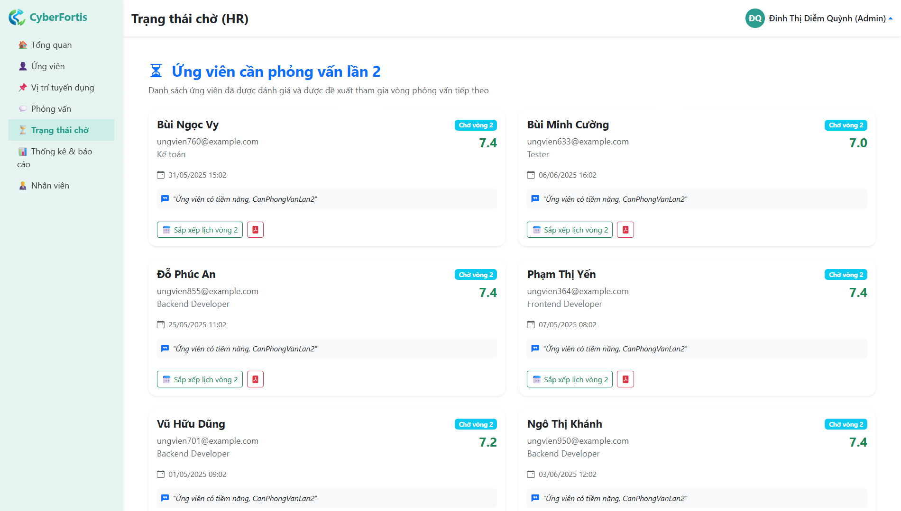

# 🚀 CyberFortis - Recruitment Management System

> Hệ thống quản lý hồ sơ tuyển dụng nội bộ được phát triển bằng ASP.NET Core MVC và SQL Server, hỗ trợ doanh nghiệp quản lý toàn bộ quy trình tuyển dụng từ tiếp nhận hồ sơ đến đánh giá và báo cáo thống kê.

---

## 📋 Project Information

| Information | Details |
|------------|------------|
| Project Name | CyberFortis Recruitment Management System |
| Project Type | Graduation Project |
| Team Size | 3 Members |
| Role | Full Stack Developer |
| Framework | ASP.NET Core MVC |
| Database | SQL Server |
| Development Tool | Visual Studio 2022 |

---

## 🎯 Main Features

### 👨‍💼 Candidate Management
- Add, update, delete candidate profiles
- Search and filter candidates
- Track recruitment status
- Manage candidate information

### 📌 Recruitment Position Management
- Create recruitment positions
- Manage hiring quantity
- Track recruitment progress
- Manage job requirements

### 🎤 Interview Management
- Schedule interviews
- Manage interview calendars
- Track interview results
- Assign interviewers

### 📝 Candidate Evaluation
- Evaluate candidates
- Score interview criteria
- Store interviewer comments
- Recommend recruitment decisions

### 👥 Employee Management
- Manage employee accounts
- User authorization
- Manage departments and roles

### 📊 Statistics & Reports
- Candidate statistics
- Recruitment performance reports
- Recruitment source analysis
- Interactive dashboard visualization

### 🔐 Authentication & Authorization
- Login / Logout
- Forgot Password
- Role-Based Access Control
- Admin / HR / Interviewer permissions

---

## 🛠 Technologies Used

### Backend
- ASP.NET Core MVC
- Entity Framework Core
- LINQ
- Dependency Injection

### Frontend
- HTML5
- CSS3
- Bootstrap 5
- JavaScript
- jQuery

### Database
- SQL Server

### Visualization
- Chart.js

### Version Control
- Git
- GitHub

---

## 🗄 Database Overview

Main entities:

- NguoiDung
- NhanVien
- UngVien
- ViTriTuyenDung
- LichPhongVan
- DanhGiaPhongVan
- PhongBan
- VaiTro

The system uses a relational database model to manage recruitment and employee information.

---

# 📷 System Screenshots

## 🔐 Login Page


User authentication and authorization page.

---

## 📊 Admin Dashboard


Features:

- Overview statistics
- Candidate tracking
- Recruitment status monitoring
- Dashboard charts and analytics

---

## 👨‍💼 Candidate Management


Features:

- Add candidate
- Edit information
- Search and filter
- Recruitment status tracking

---

## 📌 Recruitment Position Management


Features:

- Create positions
- Manage hiring quantity
- Track recruitment progress

---

## 🎤 Interview Management


Features:

- Schedule interviews
- Manage interview results
- Track interview activities

---

## ⏳ HR Waiting List



Displays candidates waiting for HR review or approval.

---

## 👥 Employee Management


Features:

- Employee account management
- Role management
- Department management

---

## 📈 Reports & Analytics


Statistics:

- Recruitment efficiency
- Candidate sources
- Conversion rate
- Recruitment reports

---

## 🎯 Interviewer Dashboard


Features:

- View interview schedules
- Evaluate candidates
- Monitor interview outcomes

---

## 🔐 User Roles

### 👑 Admin
- Manage entire system
- Manage employees
- View reports and statistics

### 👨‍💼 HR
- Manage candidates
- Manage recruitment positions
- Schedule interviews

### 🎤 Interviewer
- View assigned interviews
- Evaluate candidates
- Submit interview results

---

## ⚙️ Installation

### Clone Repository

```bash
git clone https://github.com/YOUR_USERNAME/QuanLyHSTD.git
```

### Restore Packages

```bash
dotnet restore
```

### Update Database

```powershell
Update-Database
```

### Run Project

```bash
dotnet run
```

---

## 📚 Learning Outcomes

Through this project, the team practiced:

- ASP.NET Core MVC Architecture
- Entity Framework Core
- Authentication & Authorization
- Database Design
- Dashboard Development
- Data Visualization with Chart.js
- Team Collaboration using Git & GitHub

---

## 👨‍💻 Author

CyberFortis Recruitment Management Team

Graduation Project – Information Technology
